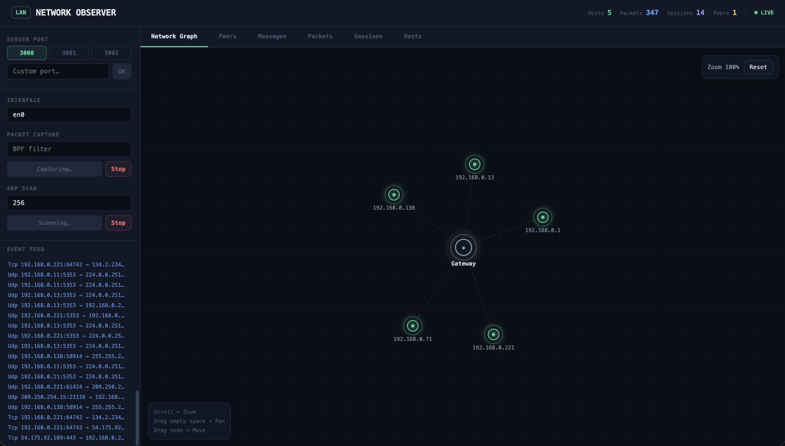

# Network Observer

A local network observability tool written in Rust. It captures packets,
discovers hosts via ARP, detects peers via mDNS, and exposes live network
state through an HTTPS/WSS API and React dashboard.



## Get Started

Start the backend and dashboard in two terminals:

```sh
INTERFACE=en0 PORT=3000 DEVICE_NAME=local cargo run
```

```sh
cd gui
npm install
npm run dev
```

Open the dashboard at `http://localhost:5173`. The backend listens on
`https://localhost:3000`; because it uses a local self-signed certificate, your
browser may ask you to trust it once. Set `INTERFACE` to your network interface
(`en0` on many macOS machines, `eth0` on many Linux machines).

## Why this project exists

This project explores system-level Rust, packet capture, async services,
local-network discovery, and runtime visibility for edge-style systems.

## Features

- TCP/UDP and ARP packet capture via pcap
- ARP-based host discovery
- Session aggregation by IP/port pair
- mDNS peer discovery
- Peer-to-peer messages and file transfer
- HTTPS/WSS backend with local self-signed certificates
- React/Vite dashboard for hosts, packets, sessions, and peers

## Tech Stack

- Rust, Tokio, Axum
- pcap, pnet, etherparse
- mDNS, rustls
- React, TypeScript, Vite
- Docker
